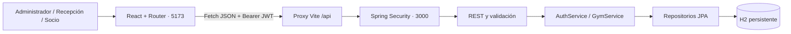

# Arquitectura e Integración — PULSE Gym OS

## Arquitectura



Frontend modular con fetch centralizado. `sessionStorage` almacena la sesión de la pestaña; H2 guarda el negocio. API stateless con validación de firma HS256, emisor y expiración mediante Spring Security/Nimbus.

## Matriz de permisos

| Área | Administrador | Recepcionista | Socio |
| --- | --- | --- | --- |
| Health / login / registro | Público | Público | Público |
| Dashboard / reportes | Sí | No | No |
| Socios / renovación | Sí | Sí | No |
| Planes | Sí | Sí | Lectura |
| Check-in / pagos del gimnasio | Sí | Sí | No |
| Personal / seguridad | Sí | No | No |
| Perfil propio | Sin membresía vinculada | Sin membresía vinculada | Membresía, pagos y visitas propios |

El registro público siempre crea SOCIO. El personal lo crea exclusivamente un Administrador. Las reglas se aplican en la API aunque se omita la interfaz.

## Contratos REST

JSON con `Authorization: Bearer <token>`, excepto endpoints públicos.

| Método | Endpoint | Permiso | Resultado |
| --- | --- | --- | --- |
| GET | `/api/health` | Público | Estado, fecha Bogotá y flag demo |
| POST | `/api/auth/login` | Público | Token, expiración, usuario |
| POST | `/api/auth/register` | Público | Socio y sesión, 201 |
| GET | `/api/auth/me` | Autenticado | Usuario sin passwordHash |
| GET | `/api/plans` | Autenticado | Planes y precios COP |
| GET | `/api/members` | Admin / Recepción | Socios y estados calculados |
| POST | `/api/members` | Admin / Recepción | Nuevo socio, 201 |
| PUT | `/api/members/{id}` | Admin / Recepción | Actualización administrativa |
| POST | `/api/members/{id}/renew` | Admin / Recepción | Renovación y pago |
| POST | `/api/check-ins` | Admin / Recepción | Permitir o rechazar ingreso |
| GET | `/api/check-ins/recent` | Admin / Recepción | Últimos diez ingresos |
| GET | `/api/payments` | Admin / Recepción | Historial de pagos |
| GET | `/api/dashboard` | Admin | KPIs y afluencia semanal |
| GET | `/api/me/profile` | Autenticado | Exclusivamente datos propios |
| GET | `/api/admin/staff` | Admin | Personal sin contraseñas |
| POST | `/api/admin/staff` | Admin | Cuenta de personal, 201 |
| GET | `/api/admin/security` | Admin | Claims verificados y matriz RBAC |

### Login

```json
{"email":"admin@correo.com","password":"Password123"}
```

Respuesta: `token`, `expiresAt`, `user` con ID, nombre, correo, rol, código de empleado y memberId.

### Registro público

```json
{"name":"María Pérez","email":"maria@example.com","password":"UnaClave123","dni":"1122334455"}
```

Se crea SOCIO con membresía inactiva. Un campo `role` adicional no concede privilegios.

### Crear / editar socio

```json
{"name":"María Pérez","dni":"1122334455","email":"maria@example.com","planId":null,"expiry":null,"enabled":false}
```

Habilitar requiere plan válido y fecha. Editar no genera cobro.

### Renovar

```json
{"planId":"full","method":"EFECTIVO"}
```

Métodos: EFECTIVO, TARJETA, TRANSFERENCIA. Monto y duración provienen del servidor. Respuesta con ID de comprobante, socio, plan, método, monto, fecha y vencimiento.

### Check-in

```json
{"dni":"1023456789"}
```

Respuesta: `allowed`, `title`, `message`, `member`, `enteredAt`. Membresía rechazada: HTTP 200 con `allowed: false`, sin visita. Rol sin permiso: HTTP 403.

## Reglas de negocio

- Cédula única de 6 a 12 dígitos; correo de acceso único y normalizado.
- Activo: habilitado con fecha vigente, inclusive al vencimiento. Vencido: fecha anterior a hoy. Inactivo: deshabilitado o sin fecha.
- Fecha, visitas e ingresos diarios en America/Bogota.
- Renovación vigente suma días al vencimiento; vencida inicia hoy y cubre 30 días contando el día actual.
- Renovación y pago en una transacción con bloqueo del socio.
- Contraseñas BCrypt y JWT de dos horas; siembra sin borrar información.
- QR del socio identifica su cédula para lectores externos; no concede acceso ni incluye lector de cámara.
- Comprobantes internos; sin facturación fiscal ni pasarela bancaria.

## Errores

400 validación/plan inválido; 401 sesión/credenciales; 403 permisos; 404 socio inexistente por ID; 409 duplicado/conflicto. Las respuestas incluyen `message`; validación incluye `fields`.

## Fases

1. Organizar monorepo y conservar prototipo.
2. Persistencia, siembra, JWT y RBAC.
3. Operaciones del gimnasio y REST.
4. Componentes React, rutas y API.
5. Pruebas de integración, compilación y navegador.
6. Documentación y capturas para evaluación.

Consultar `ESTADO_DEL_PROYECTO.md` para los resultados verificados.
