# 🏋️ PULSE Gym OS — Gym Operations & Membership Suite

> **Monorepo Full-Stack para Ingeniería Web**<br>
> **Backend**: Java 17 + Spring Boot 3.3.4 + Spring Security + JWT + H2/JPA<br>
> **Frontend**: React 19 + Vite 8 + Tailwind CSS v4 + React Router v7 + Lucide Icons<br>
> **Repositorio**: [andresloja16/API_GYM_PRACTICAS_WEB](https://github.com/andresloja16/API_GYM_PRACTICAS_WEB.git)

---

## 📋 Resumen del Proyecto

**PULSE Gym OS** es un sistema de control de gimnasios que integra la administración de socios, planes, membresías, cobros y accesos con un portal privado para los socios.

El backend de **Spring Boot** ofrece una API REST con persistencia **H2/JPA**, contraseñas BCrypt y sesiones **JWT HS256**. El frontend de **React + Tailwind CSS v4** utiliza un diseño deportivo claro, fondo gris azulado, tarjetas blancas, acentos azul cobalto y componentes compartidos. Los permisos **RBAC** se aplican tanto en React Router como en Spring Security.

### Funciones principales

- KPIs calculados desde la API: socios activos, ingresos del día y membresías próximas a vencer.
- Gráfico de afluencia con accesos registrados durante los últimos siete días.
- Check-in por cédula: **Acceso Permitido**, **Membresía Vencida**, **Socio Inactivo** y **Socio no encontrado**.
- Tabla de socios con búsqueda, filtros, paginación, badges, edición y renovación.
- Renovación transaccional con precio definido por el servidor y comprobante interno imprimible con QR.
- Planes Básico, Full Access y Premium, de 30 días.
- Registro público de socios y creación de personal exclusiva del administrador.
- Portal del socio: tarjeta digital con QR, membresía, pagos y últimas visitas propias.
- Reportes, exportación CSV, auditoría de sesión JWT y login demo de un clic.

---

## 🔑 Credenciales Demo Pre-inicializadas

`DataInitializer.java` crea cuentas y operaciones de demostración durante la primera ejecución. **Conserva los registros existentes** en siguientes arranques.

| Rol | Correo electrónico | Contraseña | ID empleado | Funcionalidades principales |
| :--- | :--- | :--- | :--- | :--- |
| **👑 ADMINISTRADOR** | `admin@correo.com` | `Password123` | `EMP-001` | Dashboard, reportes, personal y seguridad JWT/RBAC. |
| **🚪 RECEPCIONISTA** | `recepcion@correo.com` | `Password123` | `EMP-002` | Check-in, socios, renovación, pagos y comprobantes. |
| **💪 SOCIO** | `socio@correo.com` | `Password123` | N/A | Tarjeta digital, membresía, pagos y visitas propias. |

Las cuentas demo están destinadas a evaluación local. Los botones de un clic se muestran cuando la API indica `demo: true`.

| Cédula de ejemplo | Estado inicial |
| :--- | :--- |
| `1023456789` | Activo |
| `1045678901` | Vencido |
| `1067890123` | Inactivo |

Las fechas iniciales se calculan respecto al primer arranque en **America/Bogota**. Después evolucionan con los vencimientos y renovaciones.

---

## 🚀 Guía de Instalación y Ejecución Local

### 1. Requisitos previos

- **JDK 17** recomendado para reproducir la configuración verificada.
- **Node.js 20.19+ o 22.12+** y npm. Vite 8 requiere estas versiones; Node 18 no es compatible. [Requisitos oficiales](https://vite.dev/guide/).
- **Git** para clonar el repositorio.

```powershell
git clone https://github.com/andresloja16/API_GYM_PRACTICAS_WEB.git
cd API_GYM_PRACTICAS_WEB
```

### 2. Arrancar el Backend (Spring Boot API)

El backend corre en **`3000`**. La base de datos se guarda en `GymApi/data/` y se conserva entre arranques.

```powershell
cd GymApi

# Windows — Maven Wrapper, sin Maven global
.\mvnw.cmd spring-boot:run

# Linux / macOS
chmod +x mvnw
./mvnw spring-boot:run
```

Si Windows utiliza otro JDK, establece `JAVA_HOME` apuntando a tu instalación de JDK 17.

La consola muestra `Tomcat started on port 3000` y el mensaje de inicialización. Comprueba la API en [http://localhost:3000/api/health](http://localhost:3000/api/health).

### 3. Arrancar el Frontend (React + Vite)

Abre otra terminal desde la raíz del repositorio:

```powershell
cd frontend-app-ing-web
npm install
npm run dev
```

En PowerShell con ejecución de scripts restringida, usa `npm.cmd install` y `npm.cmd run dev`.

Abre **[http://localhost:5173](http://localhost:5173)**. La insignia **API: ONLINE (3000)** confirma la comunicación con Spring Boot. El proxy envía `/api` al backend; los datos del gimnasio están en H2.

Desde la raíz, `npm start` inicia el frontend y `npm run build` lo compila. El backend se inicia por separado.

### 4. Configuración

- [.env.example](./.env.example): variables del backend; establecer en la terminal. Spring Boot no carga este archivo automáticamente.
- [frontend-app-ing-web/.env.example](./frontend-app-ing-web/.env.example): URL opcional de API para Vite.
- `JWT_SECRET`: clave de al menos 32 bytes en Base64. Si se omite en desarrollo, se genera por arranque y las sesiones anteriores quedan inválidas.
- `SEED_DEMO=false`: desactiva la siembra; no borra registros existentes. Una base nueva sin siembra requiere aprovisionar planes y primer administrador.
- `ALLOWED_ORIGINS`: orígenes permitidos; por defecto localhost y 127.0.0.1 en el puerto 5173.

La sesión dura dos horas, se guarda en `sessionStorage` y se elimina del navegador al cerrar sesión.

---

## 📁 Documentación de Arquitectura y Diseño

- 🎨 **[SISTEMA_DE_DISENO_GYM_API.md](./SISTEMA_DE_DISENO_GYM_API.md)**: colores, tipografía, espaciado, componentes, estados y accesibilidad.
- 🗺️ **[PLAN_INTEGRACION_FRONTEND.md](./PLAN_INTEGRACION_FRONTEND.md)**: arquitectura, contratos REST, permisos y reglas de negocio.
- 📊 **[ESTADO_DEL_PROYECTO.md](./ESTADO_DEL_PROYECTO.md)**: implementación, pruebas y límites del alcance.

---

## 📸 Evidencias de Funcionamiento

Capturas generadas con Playwright interactuando con React y la API real. Los datos mostrados son de demostración.

### 1. Pantalla de Inicio de Sesión

Estado de API, credenciales de un clic y autenticación JWT.

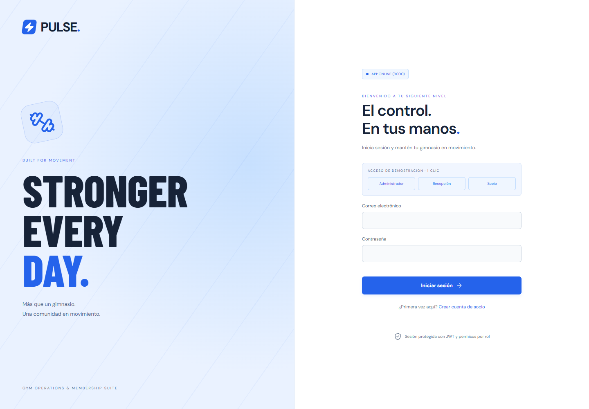

### 2. Registro de Socios

Validación de nombre, correo, cédula y contraseña. Las cuentas de personal se crean desde el panel del administrador.

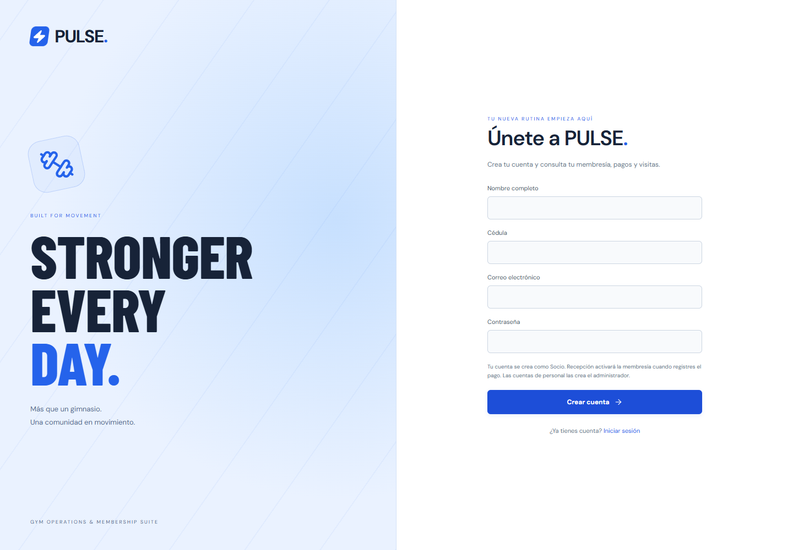

### 3. Portal del Socio

Tarjeta digital con QR de la cédula, plan, vencimiento, pagos y visitas propias. El QR identifica al socio; la API valida su acceso.

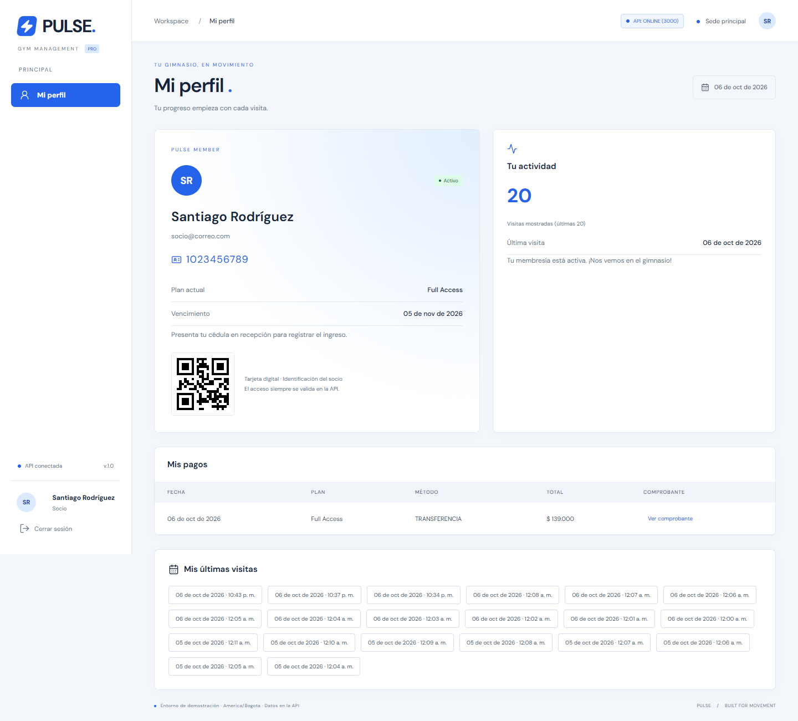

### 4. Control RBAC — 403 Forbidden

Un Socio que intenta entrar al Dashboard recibe acceso restringido. La API también rechaza operaciones de personal con HTTP 403.

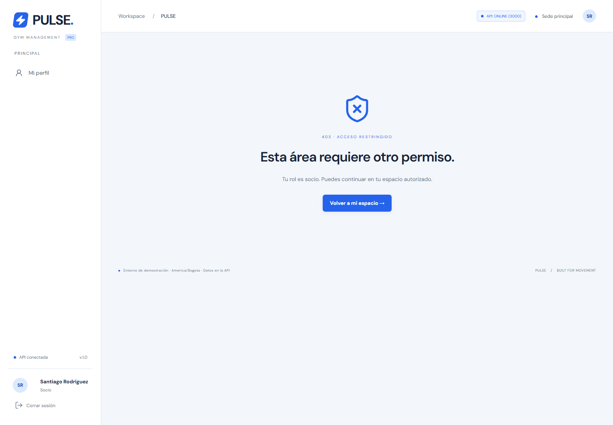

### 5. Control de Accesos de Recepción

Ingreso por cédula, validación de membresía y listado de accesos recientes.

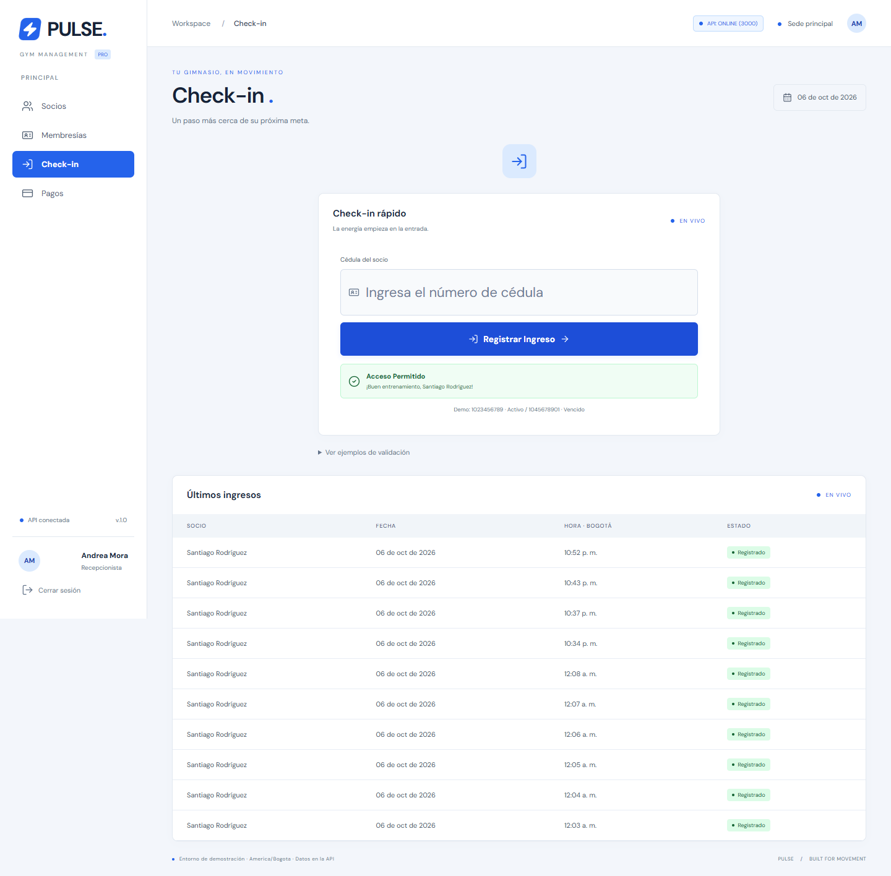

### 6. Renovación y Comprobante con QR

Pago, monto calculado en el servidor, vencimiento, QR e impresión. Es un **comprobante interno**, sin integración fiscal ni procesamiento de tarjetas.

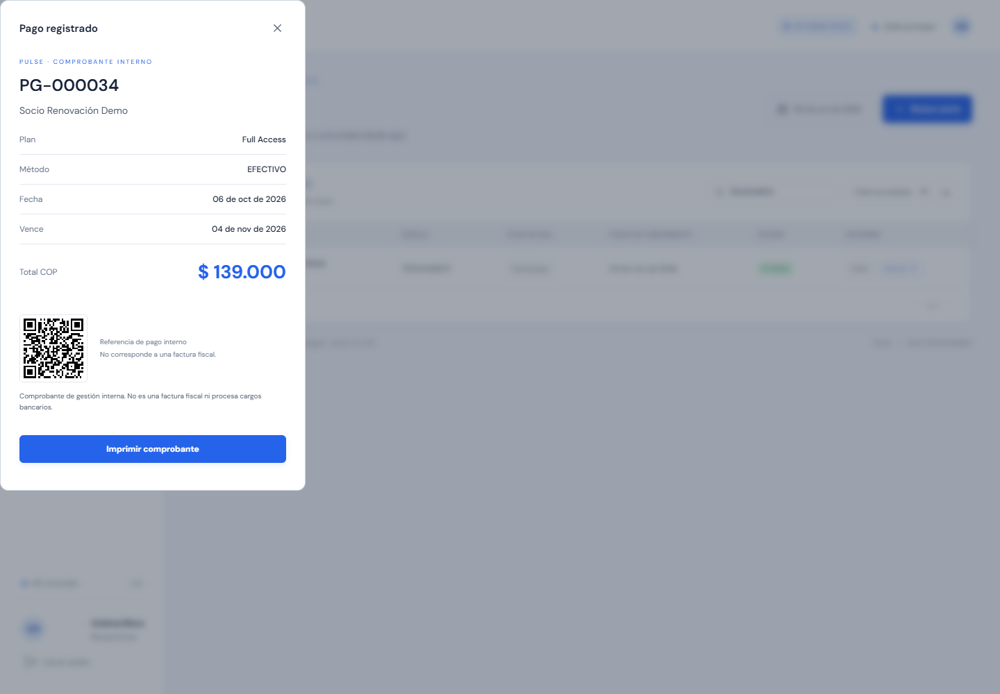

### 7. Dashboard del Administrador

KPIs, afluencia semanal, check-in rápido y tabla de socios.

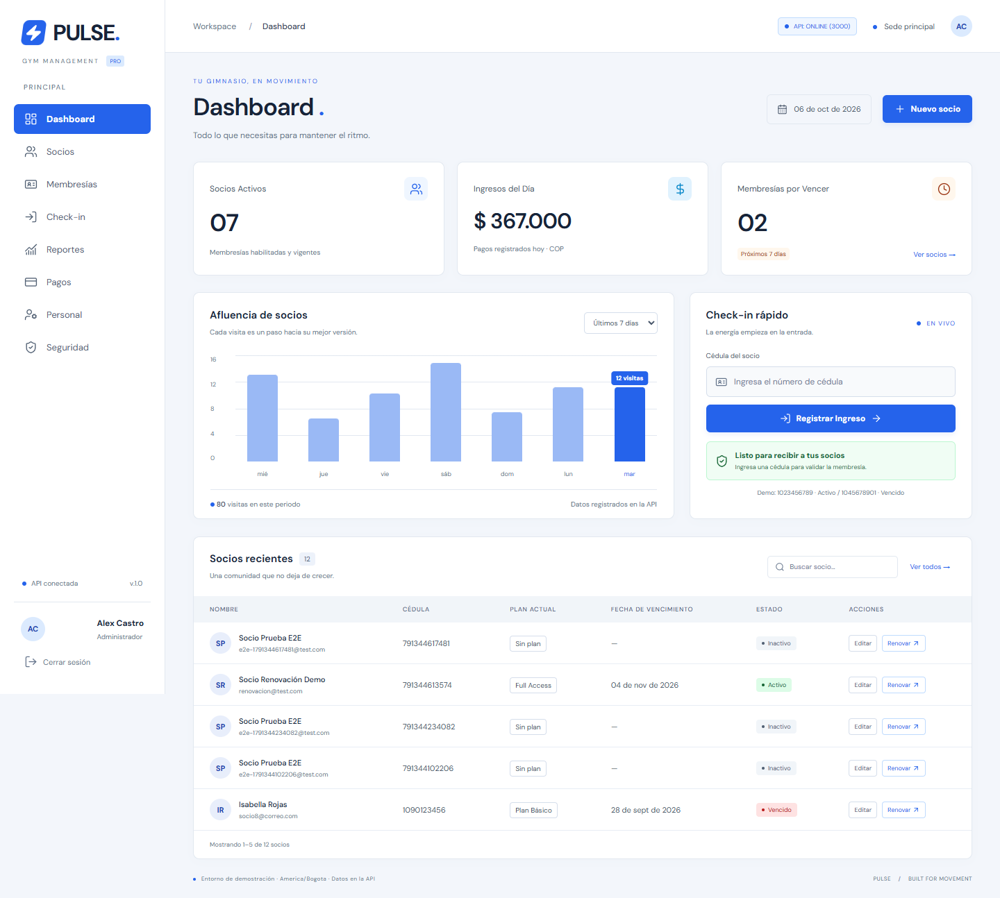

### 8. Auditoría JWT y Permisos

Emisor, HS256, rol, emisión, vencimiento y matriz RBAC. No se muestra el token completo ni la clave de firma.

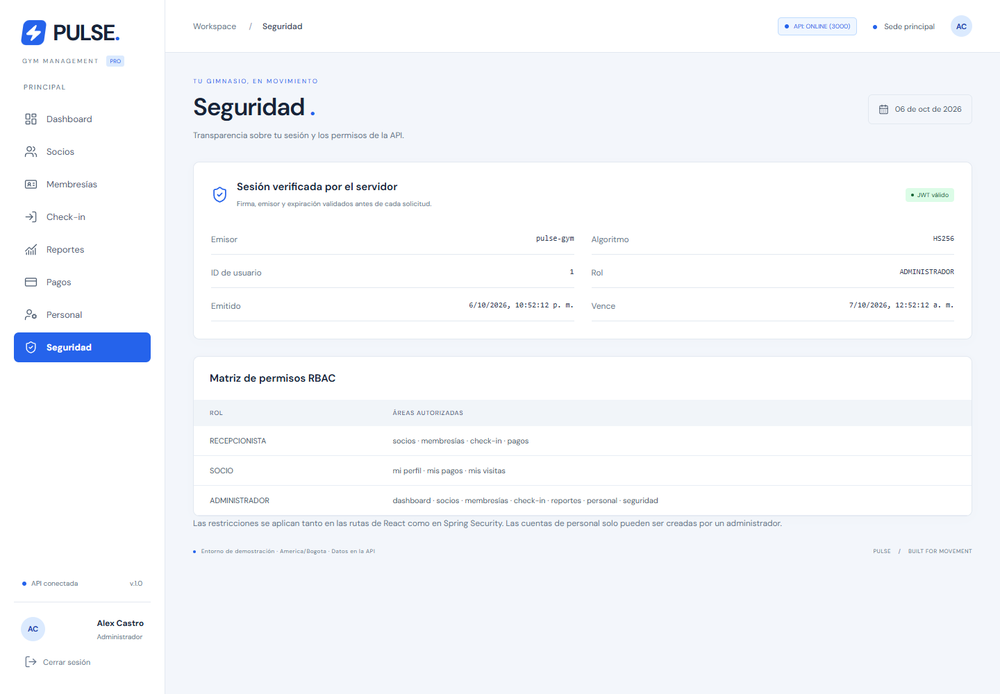

### 9. Reportes

Ingresos, operaciones, visitas y exportación de socios.

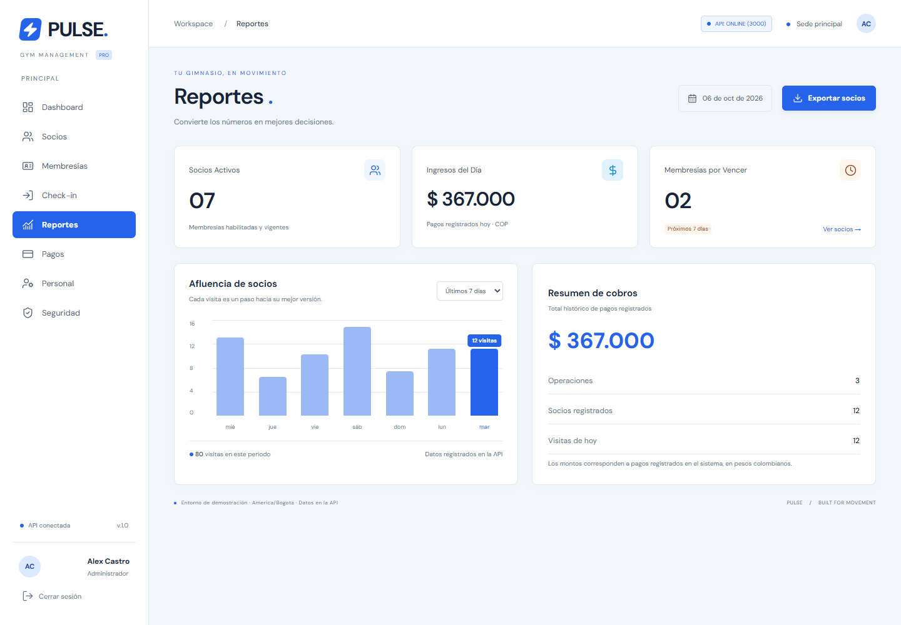

### 10. Membresía Vencida

Acceso rechazado sin crear un registro de ingreso.

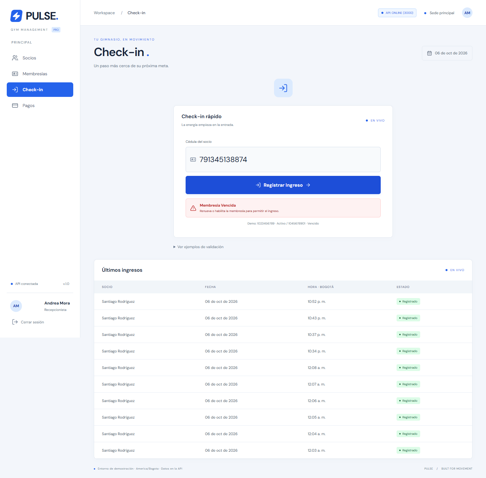

### 11. Vista Móvil

Navegación compacta, KPIs apilados y tablas con scroll interno.

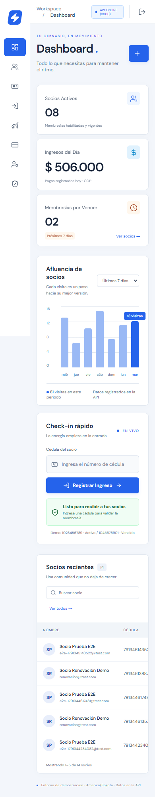

---

## 🧪 Pruebas

### Backend

```powershell
cd GymApi
.\mvnw.cmd test
```

MockMvc y H2 en memoria verifican login, token alterado, roles, datos propios, cédula, renovación y precio del servidor. Cada prueba revierte sus cambios.

### Frontend

```powershell
cd frontend-app-ing-web
npm run build

# Con la API ejecutándose; instalar Chromium una vez
npx playwright install chromium
npm run test:e2e
```

También puedes usar Edge instalado en Windows:

```powershell
$env:PW_BROWSER_CHANNEL="msedge"
npm.cmd run test:e2e
```

Los recorridos cubren login, registro, permisos, dashboard, perfil, check-in, renovación, comprobante y móvil. Crean registros de prueba en la API local y actualizan las capturas.

---

## 🏛️ Estructura del Monorepo

```text
├── GymApi/                              # Java 17 / Spring Boot 3
│   ├── src/main/java/com/pulse/gym/
│   │   ├── config/                      # SecurityConfig y DataInitializer
│   │   ├── controller/                  # API REST y errores
│   │   ├── dto/                         # Requests y Views
│   │   ├── model/                       # GymUser, Role, GymMember, Plan, Payment, CheckIn
│   │   ├── repository/                  # Repositorios JPA
│   │   ├── service/                     # AuthService y GymService
│   │   └── GymApplication.java
│   ├── src/main/resources/application.properties
│   ├── src/test/java/com/pulse/gym/GymIntegrationTest.java
│   ├── .mvn/wrapper/maven-wrapper.properties
│   ├── pom.xml
│   └── mvnw / mvnw.cmd
├── frontend-app-ing-web/                # React 19 + Vite 8
│   ├── src/
│   │   ├── components/
│   │   │   ├── auth/                    # ProtectedRoute
│   │   │   ├── layout/                  # Sidebar, header, PageHeading
│   │   │   ├── dashboard/               # AttendanceChart
│   │   │   ├── checkin/                 # CheckInPanel
│   │   │   ├── members/                 # Tabla, editor, renovación y comprobante
│   │   │   └── common/                  # Modal, badges, alertas y carga
│   │   ├── context/                     # AuthContext y JWT
│   │   ├── hooks/                       # Consultas API y conexión
│   │   ├── pages/                       # Login, registro y páginas por rol
│   │   ├── services/api.js              # Fetch con Bearer y errores
│   │   ├── index.css / base.css          # Tailwind v4 y tokens PULSE
│   │   ├── App.jsx
│   │   └── main.jsx
│   ├── tests/gym.spec.js                # Playwright
│   ├── playwright.config.js
│   ├── vite.config.js
│   ├── package.json
│   └── package-lock.json
├── docs/
│   ├── screenshots/                     # Evidencias reales
│   └── legacy-demo/                     # Prototipo estático conservado
├── SISTEMA_DE_DISENO_GYM_API.md
├── PLAN_INTEGRACION_FRONTEND.md
├── ESTADO_DEL_PROYECTO.md
├── .env.example
├── .gitignore
├── package.json                         # Atajos del frontend
└── README.md
```

---

## 👥 Desarrollador y Contacto

- **Asignatura**: Ingeniería Web.
- **Repositorio GitHub**: [andresloja16/API_GYM_PRACTICAS_WEB](https://github.com/andresloja16/API_GYM_PRACTICAS_WEB).
- **Adaptación**: estructura documental de Supermarket OS aplicada al dominio de gimnasios y al diseño PULSE.
